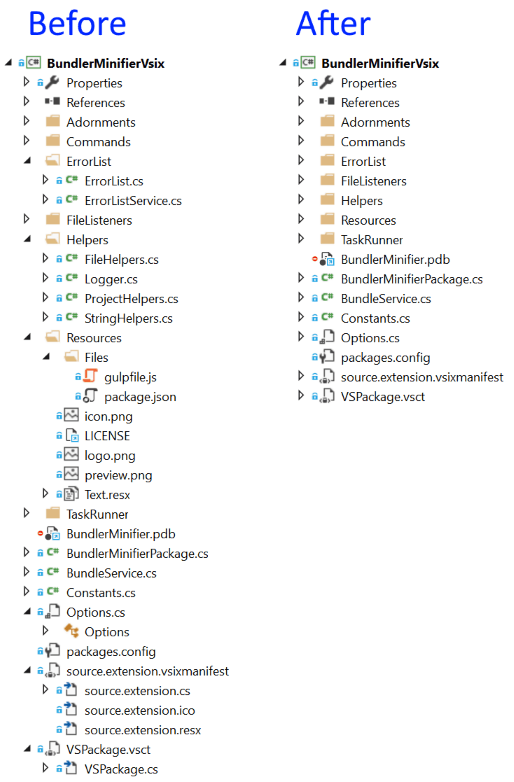
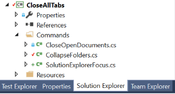
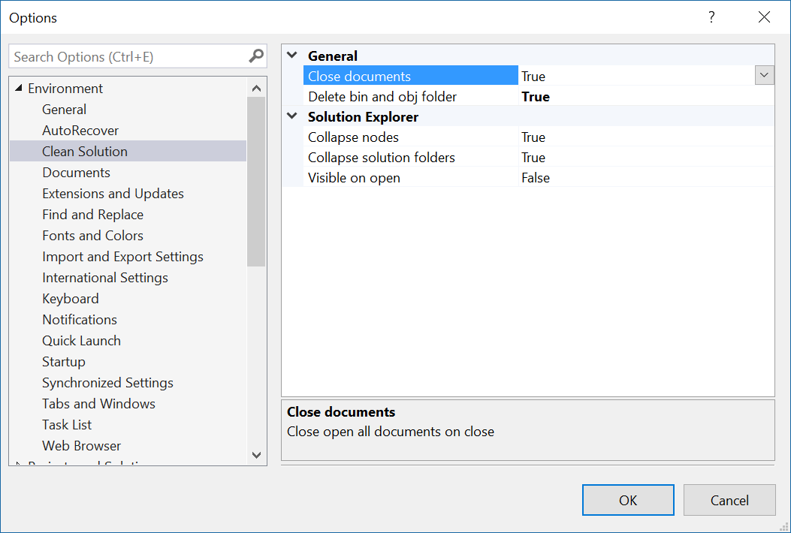

# Clean Solution

Download this extension from the [VS Gallery](https://visualstudiogallery.msdn.microsoft.com/97ffc3c6-f250-499a-b86b-833b3e55751e)
or get the [CI build](http://vsixgallery.com/extension/55640f47-34bc-436b-8820-e7f64fbb31fc/).

---------------------------------------

Cleans up the solution for the next time you open it. 
Closes open documents and collapses folders automatically when
a solution is being closed.

See the [change log](CHANGELOG.md) for changes and road map.

## Features
When Visual Studio closes or the current solution is being manually closed,
this extension will perform clean up.

- Closes all open documents
- Collapses nodes in Solution Explorer
- Activates Solution Explorer
- Delete *bin* and *obj* folders
- Super fast - you won't even notice it

### Close open documents
All open documents will be closed when the solution closes. This makes
solution load faster for the next time you open it.

### Collapse nodes in Solution Explorer
Projects and solutions can quickly become noisy to look at when folders
and nested files are expanded in Solution Explorer. 

This extension automatically collapses all expanded nodes except for
project nodes. 

Be default, solution folders are collapsed as well, but that can be
changed in the options.

### Activates Solution Explorer
Ensures that Solution Explorer is the active tool window when you open
a solution.

This is useful if you're tool window layout docks Solution Explorer
with other tool windows in the same location.

### Delete *bin* and *obj* folders
This options will delete *bin* and *obj* folders from all projects in
the solution on close.

**Note** that if any file under *bin* and *obj* is under source control,
the folders won't be deleted.

The *bin* and *obj* folders are usually safe to delete since they
are automatically generated when the solution/project is being build by
Visual Studio/MSBuild.

This feature is off by default, but can easily be enabled in the
settings.

### Settings
Disable the individual features easily from the **Tools -> Options**
dialog.

## Contribute
Check out the [contribution guidelines](.github/CONTRIBUTING.md)
if you want to contribute to this project.

For cloning and building this project yourself, make sure
to install the
[Extensibility Tools 2015](https://visualstudiogallery.msdn.microsoft.com/ab39a092-1343-46e2-b0f1-6a3f91155aa6)
extension for Visual Studio which enables some features
used by this project.

## License
[Apache 2.0](LICENSE)
